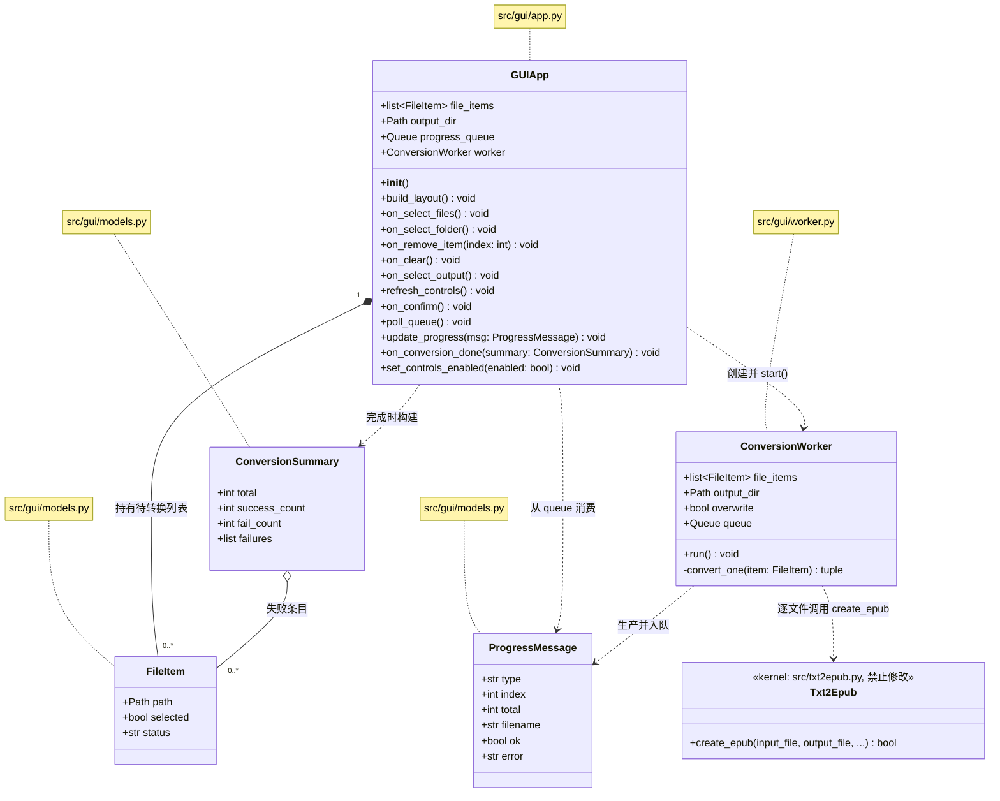
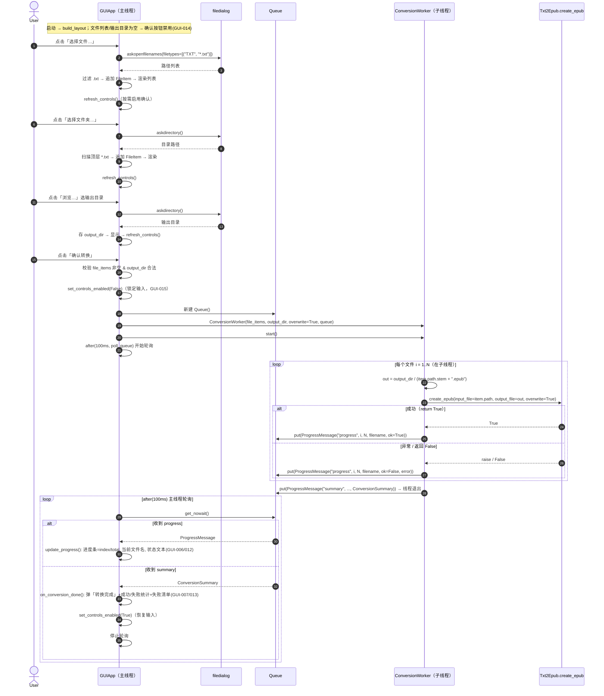
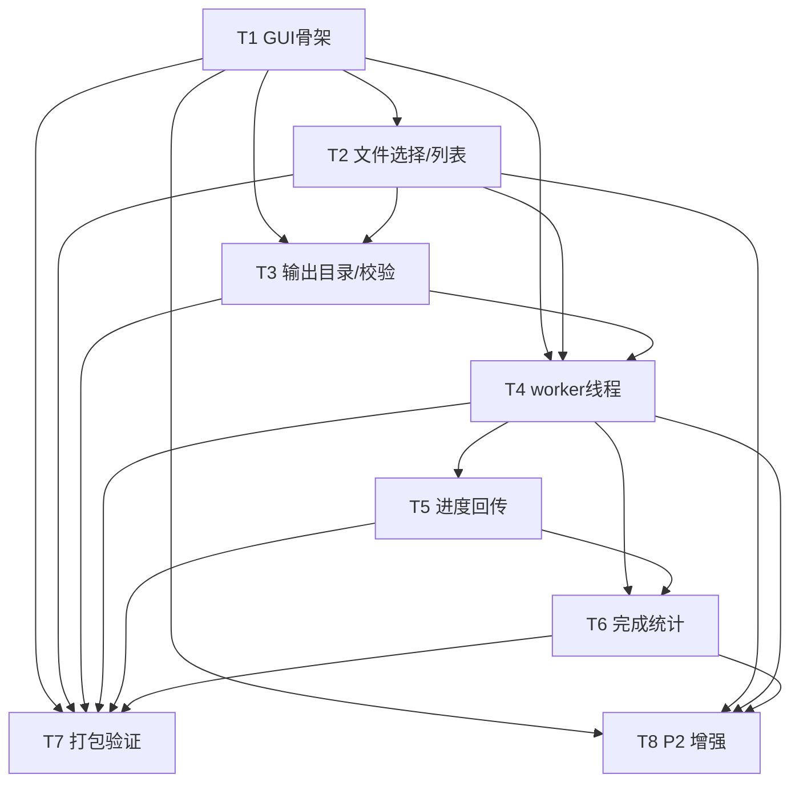

# txt2epub GUI 增量架构设计 + 任务分解

> **文档性质**：增量架构设计，仅描述「新增 Tkinter GUI 前端 + PyInstaller 打包」部分。原有 CLI（`src/__main__.py`）、转换内核（`src/txt2epub.py`）**完全不动**。
> **版本**：v1（GUI 首版） **作者**：架构师 高见远（Gao） **日期**：2025-07-24
> **输入**：`PRD_GUI.md`（许清楚）；已核对 `src/txt2epub.py`、`src/__main__.py`、`pyproject.toml`、`requirements.txt`、`src/__init__.py`、`src/utils.py`。

---

## 0. 设计总览与边界

本 GUI 本质是**编排 + 展示外壳**。所有转换能力来自既有内核 `Txt2Epub.create_epub`，GUI 不重写任何章节识别 / 编码探测 / 元数据 / 封面逻辑。

**边界铁律**：
- GUI 只做三件事：① 收集用户输入（文件列表、输出目录、少量策略）；② 在 worker 线程中按列表**逐文件**调用内核；③ 把进度/结果**安全地**回显到 Tkinter 界面。
- 内核代码（`src/txt2epub.py`、`src/utils.py`、`src/__init__.py`）零改动；CLI 入口（`src/__main__.py`）零改动。
- GUI 作为 `src` 包的新子包 `src.gui` 存在，通过**相对导入**复用内核：`from .txt2epub import Txt2Epub`。

**集成契约速查（已核对源码，真实签名）**：

```python
@staticmethod
def Txt2Epub.create_epub(
    input_file: pathlib.Path,
    output_file: pathlib.Path | None = None,
    book_identifier: str | None = None,
    book_title: str | None = None,
    book_author: str | None = None,
    book_language: str | None = None,
    book_cover: pathlib.Path | None = None,
    text_encoding: str | None = None,
    overwrite: bool = False,
    preserve_line_breaks: bool = False,
    book_description: str | None = None,
) -> bool:
```

GUI 调用约定（详见 §3 worker）：
1. **必须显式传 `output_file`** = `output_dir / (input_file.stem + ".epub")`（内核缺省会写到输入同目录，不符合 GUI 的「统一输出目录」需求）。
2. `overwrite` 默认 `True`（见 §8 决策②），故批量重跑不会因已存在而整批 `FileExistsError`。
3. 返回 `bool`；失败时抛 `ValueError` / `FileExistsError` / `OSError` / `UnicodeError`。**逐文件 `try/except`**，异常或返回 `False` 均记该文件失败，继续下一个。
4. 内核为**同步、原子写入**（先临时文件再 `os.replace`），**无章节级回调** → 进度粒度只能到「文件级」。

---

## 1. 实现方案与框架选型

| 维度 | 选型 | 理由 |
|------|------|------|
| GUI 框架 | **标准库 `tkinter` + `tkinter.ttk`** | PRD 硬约束「零新增第三方依赖」；`ttk` 提供原生风格进度条/按钮；Windows 开箱即用。 |
| 后台并发 | **`threading.Thread` + `queue.Queue` + `root.after()`** | Tkinter 仅在主线程安全；worker 线程跑转换，进度通过 `Queue` 跨线程，主线程用 `after(100ms)` 轮询队列并更新 UI。避免 UI 冻结（GUI-010）。 |
| 打包 | **PyInstaller** | PRD 指定；产出 Windows 独立 exe。默认 **单目录 `-D`**（启动快、体积友好），spec 亦可一行切换 `-F`（见 §8）。 |
| 列表控件 | `ttk.Treeview` 或 `Listbox` | 本设计用 `ttk.Treeview`（单列文件名 + 状态），便于渲染「移除」按钮与失败状态着色；也可用 `Listbox` + 自定义删除交互，二者等价。 |
| 数据传递 | `dataclass`（`FileItem` / `ProgressMessage` / `ConversionSummary`） | 跨线程/跨模块共享结构清晰、可单测。 |
| 配置持久化（P2） | 本地 JSON 文件（`pathlib` + `json`，标准库） | 记忆输出目录用，不引入第三方库。 |

**不引入**任何运行时第三方包；打包工具 `pyinstaller` 仅作为 dev/build 依赖（见 §6）。

**架构模式**：GUI 采用**单窗口控制器（MVC-lite）**——`GUIApp` 为主控制器（持有数据与状态），`models.py` 为纯数据模型，`worker.py` 为独立转换执行单元。无过度抽象，单文件可测。

---

## 2. 新增文件列表及相对路径（相对项目根 `txt2epub/`）

| 文件 | 职责 |
|------|------|
| `src/gui/__init__.py` | GUI 子包公开 API。导出 `GUIApp`、`main`；定义 `__all__`。使 `from src.gui import GUIApp` 与 `python -m src.gui` 均可用。 |
| `src/gui/__main__.py` | GUI 启动入口。`from .app import main`；`if __name__ == "__main__": main()`。被 `python -m src.gui` 与 PyInstaller 的 spec 脚本同时作为入口。`src/__main__.py`（CLI）**不改动**。 |
| `src/gui/models.py` | **纯数据 + 常量**。`FileItem`（待转换文件条目）、`ProgressMessage`（线程→主线程进度消息）、`ConversionSummary`（完成统计）；以及模块常量 `GUI_TITLE`、`DEFAULT_OVERWRITE`、`TXT_SUFFIX`、`POLL_INTERVAL_MS`、`SCAN_RECURSIVE`。无任何 Tk / 线程依赖，便于单测。 |
| `src/gui/worker.py` | **`ConversionWorker(threading.Thread)`**。接收 `file_items`、`output_dir`、`overwrite`、`queue`；`run()` 顺序遍历每个文件，计算 `output_file`，调用 `Txt2Epub.create_epub`，逐文件 `try/except`，向 `queue` 推送 `ProgressMessage`，结束推送 `ConversionSummary`。不触碰任何 Tk 对象。 |
| `src/gui/app.py` | **`GUIApp(tk.Tk)` 主窗口控制器 + `main()`**。构建三大区布局（文件区 / 输出目录区 / 进度区）、底部「确认转换」按钮；实现所有事件处理（`on_select_files`、`on_select_folder`、`on_remove_item`、`on_clear`、`on_select_output`、`on_confirm`、`poll_queue`、`update_progress`、`on_conversion_done`、`set_controls_enabled`）；编排 worker 启动与队列轮询。 |
| `txt2epub-gui.spec` | **PyInstaller 打包配置**（项目根）。入口指向 `src/gui/__main__.py`；`console=False`（窗口程序）；`hiddenimports` 含 tkinter 各子模块与 `src.txt2epub`/`src.utils`；`datas` 显式收集 `langdetect/profiles`（否则打包后语种识别报错）；默认 `COLLECT` 单目录 `-D`。 |
| `src/gui/config.py` **（P2 可选）** | 本地配置读写（`load/save_last_output_dir`），支撑 GUI-017 记忆目录。标准库 `json` 实现。仅在实现 T8 时创建。 |

> **不改动文件**：`src/txt2epub.py`、`src/utils.py`、`src/__init__.py`、`src/__main__.py`、`pyproject.toml`、`requirements.txt`。

---

## 3. 数据结构与接口（类图，Mermaid classDiagram）



**关键类型说明**：
- `FileItem.status`：`"pending" | "converting" | "done" | "failed"`（用于列表着色，v1 至少区分 done/failed）。
- `ProgressMessage.type`：`"progress"`（每文件一条）或 `"summary"`（全部结束一条）。
- `ConversionSummary.failures`：`list[tuple[str, str]]`，每项 = `(文件名, 错误原因)`。

---

## 4. 程序调用流程（时序图，Mermaid sequenceDiagram）

重点体现 Tkinter 单线程下如何避免冻结：**worker 子线程 + `queue.Queue` + `root.after(100ms, poll_queue)`** 模式。



**要点**：
- `W` 全程不碰 Tk；所有 UI 变动只在 `App` 主线程。
- `poll_queue` 用 `get_nowait()` 一次性排空队列消息，再 `self.after(POLL_INTERVAL_MS, self.poll_queue)` 续排；收到 `summary` 后不再续排。
- `on_confirm` 开头判 `if self.worker and self.worker.is_alive(): return`（防重复点击并发，GUI-005）。
- 单文件失败不影响其余（GUI-011）：worker 继续下一个，失败计入 `ConversionSummary.failures`。

---

## 5. 任务列表（有序、含依赖、按实现顺序）

> 说明：任务按功能模块/依赖分组，GUI 以 `app.py` 为编排中枢，多个任务会演进式修改 `app.py`（每次新增一类独立、可单测的行为），配套 `models.py` / `worker.py` 提供数据与方法。每个任务标注源文件、依赖、优先级。

### T1 — 搭建 GUI 骨架（窗口 + 三大区布局 + 入口）
- **源文件**：`src/gui/__init__.py`、`src/gui/__main__.py`、`src/gui/models.py`、`src/gui/app.py`（骨架）
- **依赖**：无（首个任务）
- **优先级**：P0
- **内容**：建立 `src.gui` 包；`models.py` 定义 `FileItem`/`ProgressMessage`/`ConversionSummary` 与常量；`app.py` 实现 `GUIApp(tk.Tk)` 与 `main()`，用 `ttk.Frame` 搭出①文件区 ②输出目录区 ③进度区 + 底部「确认转换」按钮的空壳布局；`__main__.py` 提供 `python -m src.gui` 入口。此时按钮/列表为空实现，仅验证窗口能起。

### T2 — 文件/文件夹选择 + .txt 扫描过滤 + 列表渲染与删减
- **源文件**：`src/gui/app.py`、`src/gui/models.py`（FileItem）、`src/gui/__init__.py`
- **依赖**：T1
- **优先级**：P0
- **内容**：实现 `on_select_files`（`askopenfilenames` 多选，仅收 `.txt`，非 txt 忽略/提示 → GUI-001）、`on_select_folder`（`askdirectory` 后扫描顶层 `*.txt` → GUI-002）、Treeview 列表渲染（文件名列 + 状态列 + 每行「移除」按钮）、`on_remove_item`/`on_clear`（→ GUI-003）。列表即「待转换全集」。

### T3 — 输出目录选择 + 校验（按钮禁用）
- **源文件**：`src/gui/app.py`、`src/gui/models.py`（常量）
- **依赖**：T1、T2
- **优先级**：P0
- **内容**：实现 `on_select_output`（`askdirectory` 回填只读输入框 → GUI-004）；`refresh_controls()` 校验「列表非空 且 输出目录合法」→ 启用/禁用「确认转换」（→ GUI-014）。

### T4 — worker 线程封装 + 逐文件调用 create_epub + 异常捕获
- **源文件**：`src/gui/worker.py`（新）、`src/gui/app.py`（on_confirm 编排）、`src/gui/models.py`（ProgressMessage/ConversionSummary）
- **依赖**：T1、T2、T3
- **优先级**：P0
- **内容**：新建 `ConversionWorker(threading.Thread)`；`app.py` 的 `on_confirm` 校验后创建 `Queue` 与 worker 并 `start()`（先判重入）。worker 逐文件：`out = output_dir / (item.path.stem + ".epub")` → `try: Txt2Epub.create_epub(input_file=item.path, output_file=out, overwrite=DEFAULT_OVERWRITE)` → 成功推 `ProgressMessage(ok=True)`，异常（`ValueError/FileExistsError/OSError/UnicodeError`）或返回 `False` 推 `ProgressMessage(ok=False, error=str(e))`；结束推 `ConversionSummary`。复用内核：`from .txt2epub import Txt2Epub`（→ GUI-008/010/011）。

### T5 — 进度回传（queue + after）+ 进度条/当前文件/已处理总数更新
- **源文件**：`src/gui/app.py`（poll_queue/update_progress）、`src/gui/worker.py`（put 消息）、`src/gui/models.py`
- **依赖**：T4
- **优先级**：P0
- **内容**：`app.py` 实现 `poll_queue`（主线程 `after(POLL_INTERVAL_MS, poll_queue)`，`get_nowait()` 排空）与 `update_progress`（进度条值 = `index/total`、当前文件名标签、`已处理/总数` 文本 → GUI-006/012）。worker 已在 T4 入队，本任务接通回显。

### T6 — 完成统计 + 「转换完成」提示 + 失败清单
- **源文件**：`src/gui/app.py`（on_conversion_done）、`src/gui/models.py`（ConversionSummary）、`src/gui/worker.py`
- **依赖**：T4、T5
- **优先级**：P0
- **内容**：`poll_queue` 收到 `summary` 后调用 `on_conversion_done`：弹「转换完成」对话框含成功/失败数（`messagebox.showinfo` 或自定义 Text 区），可滚动列出失败文件名 + 原因（→ GUI-007/013）；恢复输入控件（`set_controls_enabled(True)`）；进度条置满。

### T7 — PyInstaller spec + 打包验证
- **源文件**：`txt2epub-gui.spec`（新）、`src/gui/__main__.py`（入口校验）
- **依赖**：T1–T6
- **优先级**：P0
- **内容**：编写 `txt2epub-gui.spec`（详见 §1 / §8）；安装 `pyinstaller`（dev 依赖）；`pyinstaller txt2epub-gui.spec` 产出 `dist/txt2epub-gui/`；在干净 Windows 环境验证 exe 可启动、选文件/文件夹、转换、进度、完成统计均正常；确认 `langdetect` 语种识别在打包后可用（spec 已收 profiles）。CLI `txt2epub convert …` 验证未被破坏（→ GUI-009）。

### T8 —（P2 可选）拖拽 / 记忆目录 / 自动打开输出 / 高级参数 / 覆盖策略
- **源文件**：`src/gui/config.py`（新，记忆目录）、`src/gui/app.py`（拖拽/开关/高级面板）、`src/gui/worker.py`（覆盖策略）
- **依赖**：T1–T6
- **优先级**：P2
- **内容**：
  - GUI-016 拖拽：因「零新增第三方依赖」约束，**不引入 `tkinterdnd2`**；采用 Windows `ctypes` 调 `DragAcceptFiles` 实现，或推迟。
  - GUI-017 记忆目录：`config.py` 用本地 JSON（`%APPDATA%/txt2epub/gui.json` 或项目内 `.txt2epub-gui.json`）持久化上次输出目录，启动时回填。
  - GUI-018 完成后自动打开输出目录：可选勾选（`os.startfile(output_dir)`）。
  - GUI-019 高级参数：折叠面板暴露编码/封面/标题/作者，默认空→走内核自动识别，填写后透传 `create_epub`。
  - GUI-020 覆盖策略：勾选「跳过已存在文件」时 `overwrite=False` 且 worker 先判 `output_file.exists()` 则跳过（不计失败）。

---

## 6. 依赖包列表

**运行时（已由现有 `requirements.txt` / `pyproject.toml` 覆盖，GUI 不新增）**：
```
ebooklib>=0.18        # 内核 EPUB 写
langdetect>=1.0.0     # 内核语种识别
charset-normalizer>=3.3.0  # 内核编码探测
pillow>=10.4.0        # 内核封面转换（src.utils 引用）
```
GUI 本体仅用**标准库**：`tkinter`、`tkinter.ttk`、`tkinter.filedialog`、`tkinter.messagebox`、`threading`、`queue`、`pathlib`、`dataclasses`、`json`（P2）。

**打包（dev / build 依赖，新增）**：
```
pyinstaller>=6.0      # 仅打包阶段使用，不入运行时 requirements
```
> 建议将 `pyinstaller` 加入 `pyproject.toml` 的 `[dependency-groups].dev`（现有 dev 组仅有 `ruff`），或在打包说明中显式 `pip install pyinstaller`。

---

## 7. 共享知识（跨文件约定）

1. **路径处理**：一律 `pathlib.Path`；输出路径统一由 `output_dir / (input_file.stem + ".epub")` 计算（**不**依赖内核缺省同目录行为）。扫描文件夹默认**非递归**（顶层 `*.txt`）；递归留作后续扩展。
2. **进度消息数据结构**：`ProgressMessage`（`models.py`）为跨线程唯一消息载体，字段固定：`type ∈ {"progress","summary"}`、`index:int`、`total:int`、`filename:str`、`ok:bool`、`error:str`（可选）。主线程据 `type` 分流处理。
3. **线程安全约定**：
   - **只有 `queue.Queue` 允许跨线程**；worker 严禁访问任何 Tk 对象（不读 widget、不写变量供 UI 直接读）。
   - **所有 UI 更新只在主线程**通过 `root.after()` 触发；`poll_queue` 是唯一 UI 更新入口。
   - 常量 `POLL_INTERVAL_MS = 100`（轮询间隔）。
4. **overwrite 默认策略常量**：`DEFAULT_OVERWRITE = True` 置于 `models.py`（集中管理，便于 P2 覆盖开关读取）。
5. **异常与失败约定**：worker 捕获 `(ValueError, FileExistsError, OSError, UnicodeError)`；内核返回 `False` 亦视为失败；失败信息 `error=str(e)` 入 `ConversionSummary.failures`。失败文件**不产生残缺 epub**（内核原子写入保证，PRD §5④）。
6. **防重入**：`on_confirm` 先判 `worker.is_alive()`；转换期间 `set_controls_enabled(False)` 锁定所有输入（GUI-015）。
7. **界面语言**：中文硬编码（PRD §5⑦），暂不国际化。
8. **可测性**：`models.py` 纯数据可直测；`worker.py` 可不依赖 Tk 单测（注入假 `queue` 与 `FileItem`，断言 `ProgressMessage` 序列）；QA（任务 #4）用 `tests/old/*.txt` 做实转换集成验证。

---

## 8. 待明确事项（PRD §5 收敛为架构决策）

PRD §5 的待确认点，除第⑥项外均在架构层按 PRD 默认建议拍板，无需再问用户：

| # | PRD 待确认点 | 架构决策（已定） |
|---|--------------|------------------|
| ① | 进度粒度 | **文件级**（内核无章节回调，超出范围）。 |
| ② | overwrite 策略 | **默认 `True`**（重跑即重生成，批量不因已存在整批失败）；P2 提供「跳过已存在」开关（GUI-020）。 |
| ③ | 中途中止 | **v1 不支持**（无取消按钮），保证原子性与状态一致。 |
| ④ | 失败是否产残缺 epub | 不会（内核原子写入），无需额外清理。 |
| ⑤ | 暴露高级参数 | **v1 不暴露**，全走内核自动识别；P2 暴露（GUI-019）。 |
| ⑦ | 界面语言 | **中文界面**，暂不国际化。 |

**仍需主理人/打包阶段最终拍板的 1 项**：
- **⑥ 打包形态 `-D`（单目录，默认）vs `-F`（单文件 exe）**：本设计 spec 默认 **`-D`**（启动更快、依赖加载稳、体积友好），与 PRD §5⑥ 一致；GUI 代码与两者均无关，仅 `txt2epub-gui.spec` 的 `EXE`/`COLLECT` 配置不同（一行切换）。团队主任务书称「打包成 Windows 独立 exe」——`-D` 同样产出可独立运行的 `txt2epub-gui.exe`（随同目录）。**若主理人要求交付单个 `.exe` 文件，将 spec 改为 `-F` 即可，不涉及任何源码改动**。请打包阶段（任务 #5）确认。

**其余架构层补充决策（无需用户拍板，已定）**：
- 文件列表即「待转换全集」；v1 用「移除单条 / 清空全部」编辑，不做逐条勾选跳过（避免状态歧义）；逐条跳过留作 P2。
- 扫描文件夹默认非递归（顶层 `*.txt`）。
- 失败后 v1 不重试。
- 打包图标：`icon=None` 占位，主理人若提供 `.ico` 填入 spec 即可。
- `langdetect` profiles 数据已在 spec 的 `datas` 显式收集，规避打包后「profiles not found」常见坑。

---

## 9. 任务依赖图（Mermaid graph）


