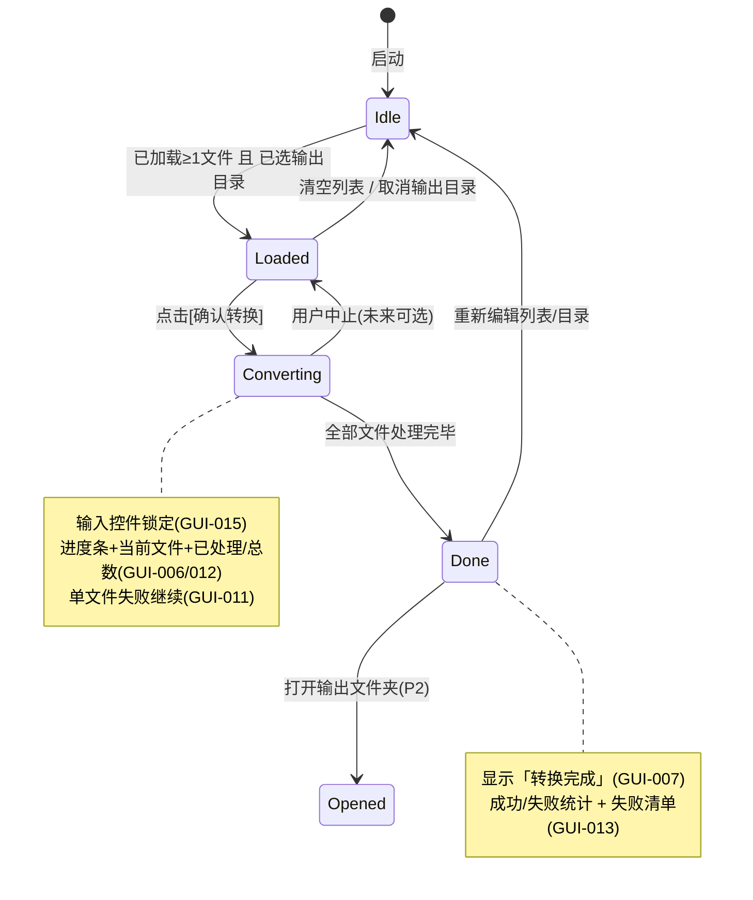

# txt2epub GUI 增量 PRD（软件产品需求文档）

> **文档性质**：增量 PRD，仅描述「新增 GUI 前端」部分。原有 CLI 入口、命令行功能与核心转换逻辑（`src/txt2epub.py`）均**保持不变**。
> **版本**：v1（GUI 首版） **作者**：产品经理 许清楚（Xu） **日期**：2025-07-24

---

## 0. 关键约束与集成契约（实现前必读）

本 GUI 层本质是一个**编排 + 展示**外壳，所有转换能力均来自已有内核。

- **复用内核**：`src/txt2epub.py::Txt2Epub.create_epub`（`@staticmethod`），GUI **不重写**任何章节识别 / 编码探测 / 元数据 / 封面逻辑。
- **真实函数签名（已核对源码）**：

  ```python
  @staticmethod
  def create_epub(
      input_file: pathlib.Path,
      output_file: pathlib.Path | None = None,
      book_identifier: str | None = None,
      book_title: str | None = None,
      book_author: str | None = None,
      book_language: str | None = None,
      book_cover: pathlib.Path | None = None,
      text_encoding: str | None = None,
      overwrite: bool = False,
      preserve_line_breaks: bool = False,
      book_description: str | None = None,
  ) -> bool:
  ```

- **影响 GUI 设计的关键行为**：
  1. `output_file` 缺省时写入「输入文件同目录、同名 `.epub`」。GUI **必须显式传入** `output_file = 输出目录 / (输入文件.stem + ".epub")`。
  2. `overwrite` 默认 `False`；若目标 `.epub` 已存在且 `overwrite=False` → 抛 `FileExistsError`。批量场景需明确覆盖策略（见 §5 待确认②）。
  3. 返回 `bool`；失败时抛 `ValueError` / `FileExistsError` / `OSError` / `UnicodeError`。GUI 需**逐文件** `try/except`，异常与返回 `False` 均记为「该文件失败」。
  4. 转换为**同步、原子写入**（先写临时文件再 `os.replace`），核心**不提供章节级进度回调** → 进度粒度只能到「文件级」（见 §5 待确认①）。
- **打包**：PyInstaller 产出 Windows 独立 exe；GUI 用标准库 **Tkinter**（零新增第三方依赖，保持体积最小）。

---

## 1. 产品目标（增量）

为现有 txt2epub 命令行工具提供一个轻量、零额外依赖的 Windows 图形界面，让非技术用户通过「选文件 / 选文件夹 → 调整列表 → 选输出目录 → 一键批量转换 → 看进度与结果」完成 TXT→EPUB 批量转换；**原有 CLI 与转换内核保持完全不变**。

---

## 2. 用户故事

- **US-1 批量选文件**：作为普通用户，我想在文件对话框中一次性多选多个 `.txt`，以便一次性转换多本小说，而不必反复敲命令。
- **US-2 选文件夹并删减**：作为用户，我想选择一个文件夹让软件自动扫描出其中所有 `.txt`，并能把不想要的文件从列表中移除，以免误转无关文件。
- **US-3 选输出目录并确认**：作为用户，我想指定一个输出文件夹，并在文件列表与输出目录都确认无误后点击「确认转换」，开始批量处理。
- **US-4 看进度**：作为用户，我想在转换时看到进度条、当前文件名和「已处理 / 总数」，以便了解还需等待多久。
- **US-5 看完成与失败**：作为用户，转换结束后我想看到「转换完成」提示及成功 / 失败数量；个别文件失败不应阻断其余文件。
- **US-6（P2）便捷性**：作为用户，我希望能拖拽文件进窗口、记住上次输出目录、转换后自动打开输出文件夹。

---

## 3. 需求池（P0 / P1 / P2）

| 需求 ID | 描述 | 优先级 | 验收标准 |
|---------|------|--------|----------|
| GUI-001 | 批量选择 TXT 文件 | **P0** | 文件对话框支持多选；仅接受 `.txt`（非 txt 被拒绝或提示）；选中后加入文件列表。 |
| GUI-002 | 文件夹选择 + 扫描加载 | **P0** | 选择文件夹后扫描其中所有 `.txt`（默认非递归顶层）并加入列表；扫描数量正确。 |
| GUI-003 | 文件列表可删减 | **P0** | 每条文件带「移除」按钮（并附「清空列表」）；点击后该文件消失且不再参与转换。 |
| GUI-004 | 输出目录选择 | **P0** | 提供输出目录输入框 + 「浏览…」按钮（`askdirectory`）；可选合法目录并回填。 |
| GUI-005 | 「确认转换」按钮 | **P0** | 点击后按列表顺序逐个调用内核转换；重复点击不会并发触发。 |
| GUI-006 | 进度显示 | **P0** | 转换中显示进度条 + 当前文件名 + 「已处理 / 总数」；结束后进度归位 / 满格。 |
| GUI-007 | 完成提示 | **P0** | 全部结束后显示「转换完成」及成功 / 失败统计。 |
| GUI-008 | 复用转换内核 | **P0** | GUI 仅做编排，调用 `Txt2Epub.create_epub`；转换产物与 CLI 等价；核心逻辑零改动。 |
| GUI-009 | 保留原 CLI | **P0** | 命令行入口与功能完全不变；新增 GUI 不破坏 `txt2epub convert …`。 |
| GUI-010 | 后台线程转换 | **P0** | 转换在 worker 线程执行，UI 不冻结；进度经线程安全方式（如 `queue` + `after()`）更新。 |
| GUI-011 | 单文件失败不阻断整体 | **P1** | 某文件异常 / 返回 `False` 时记录并继续；失败文件数计入统计，其余正常完成。 |
| GUI-012 | 进度条 + 已处理/总数实时 | **P1** | 每完成一个文件更新进度 = 已完成 / 总数，并刷新当前文件名。 |
| GUI-013 | 失败列表展示 | **P1** | 结束后列出失败文件名 + 错误原因（可滚动 / 可复制）。 |
| GUI-014 | 校验与按钮禁用 | **P1** | 列表为空或未选输出目录时，「确认转换」禁用；条件满足后启用。 |
| GUI-015 | 转换中锁定输入 | **P1** | 转换期间禁用文件 / 目录选择、列表增删，防止状态错乱；完成后恢复。 |
| GUI-016 | 拖拽支持 | **P2** | 拖拽文件 / 文件夹到窗口可自动加入列表。 |
| GUI-017 | 记忆上次输出目录 | **P2** | 持久化上次输出目录（本地配置文件），启动时回填。 |
| GUI-018 | 完成后自动打开输出文件夹 | **P2** | 提供可选开关（默认关）；勾选后结束自动打开资源管理器到输出目录。 |
| GUI-019 | 高级选项（可选） | **P2** | 暴露编码 / 封面 / 标题 / 作者，默认留空走核心自动识别；填写后透传 `create_epub`。 |
| GUI-020 | 覆盖策略开关 | **P2** | 「跳过已存在文件」勾选，配合 `overwrite`（见 §5②）。 |

---

## 4. UI 设计稿

### 4.1 主窗口布局（ASCII 草稿）

```
+------------------------------------------------------------------+
|  txt2epub  GUI                                  [菜单 / 关于]      |  <- 标题栏
+------------------------------------------------------------------+
|  ① 文件选择区                                                     |
|  [ 选择文件... ] [ 选择文件夹... ]        已加载 N 个文件          |
|  +------------------------------------------------------------+  |
|  | ☑ 小说A.txt                                    [ 移除 ]     |  |
|  | ☑ 小说B.txt                                    [ 移除 ]     |  |
|  | ☑ 小说C.txt                                    [ 移除 ]     |  |
|  +------------------------------------------------------------+  |
|  ( ☑全选 / 清空列表 )                                            |
+------------------------------------------------------------------+
|  ② 输出目录区                                                    |
|  输出到: [ D:\输出\______________________________ ] [ 浏览... ]  |
+------------------------------------------------------------------+
|  ③ 进度区                                                        |
|  进度: [==============================        ] 60%             |
|  状态: 正在转换 小说C.txt  ( 3 / 5 )                             |
+------------------------------------------------------------------+
|                        [        确认转换        ]                |  <- 底部大按钮
+------------------------------------------------------------------+
```

- **① 文件列表区**：`Listbox`（或带勾选的 `Treeview`）展示已加载 `.txt`；每行对应「移除」按钮；顶部「选择文件… / 选择文件夹…」与「全选 / 清空」。
- **② 输出目录区**：只读输入框 + 「浏览…」（仅选目录）。
- **③ 进度区**：`ttk.Progressbar` + 状态文本（当前文件名、已处理/总数）。
- **底部**：醒目「确认转换」按钮，受 GUI-014 校验控制。

### 4.2 窗口状态机（Mermaid）



---

## 5. 待确认问题（含默认建议）

| # | 待确认点 | 默认建议（如无异议即按此实现） |
|---|----------|------------------------------|
| ① | **进度粒度：按文件还是按章节？** | **按文件**。核心 `create_epub` 为同步原子写入，无章节级回调；章节级进度需重构内核（超出本次范围）。文件级已满足用户「看进度」诉求。 |
| ② | **已存在输出文件如何处理（overwrite 策略）？** | 默认 `overwrite=True`，覆盖已有 `.epub`（符合「重跑即重生成」直觉）；并提供「跳过已存在文件」勾选（GUI-020，P2）。批量场景不希望因已存在而整批失败。 |
| ③ | **是否支持中途中止（取消按钮）？** | **v1 不支持中途中止**。简化实现、保证原子性与状态一致；后续版本可加。建议 v1 不做。 |
| ④ | **失败文件是否生成部分 epub？** | 不会。核心为原子写入（先临时文件再替换），失败不产生残缺产物；失败文件无输出，无需额外清理。 |
| ⑤ | **GUI 是否暴露高级参数（编码 / 封面 / 标题作者）？** | **v1 不暴露**，全部走核心自动识别（与 CLI 默认行为一致）；高级项列为 P2（GUI-019）。 |
| ⑥ | **PyInstaller 单文件(-F) 还是单目录(-D)？** | 默认 **单目录(-D)**：启动更快、体积友好、依赖加载稳定。若主理人需单 exe 交付可改 `-F`（启动略慢）。由打包阶段最终决定。 |
| ⑦ | **界面语言 / 国际化？** | 默认**中文界面**（目标用户为中文小说转换）。暂不国际化。 |

---

## 6. 范围边界（明确不做）

- 不修改 `src/txt2epub.py` 任何转换逻辑（仅被调用）。
- 不修改 `src/__main__.py` 及 `txt2epub convert …` 命令行行为。
- 不新增运行时第三方依赖（Tkinter 为标准库）。
- 不实现云端 / 网络功能、不实现 EPUB 预览编辑。
